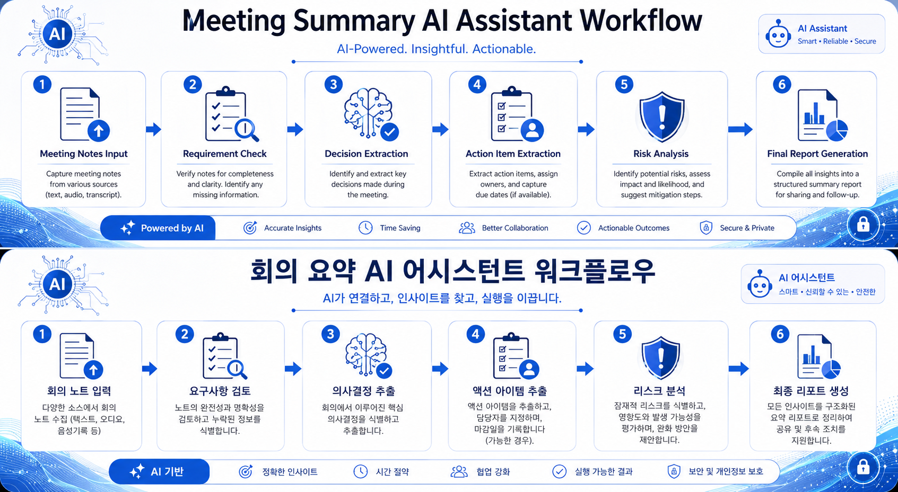

# LLM Prompt Engineering Mission

## 프로젝트 소개

본 프로젝트는 대규모 언어 모델(LLM)을 활용한 업무 자동화 프롬프트 설계 과제입니다.

회의록 요약 및 Action Item 추출 업무를 대상으로 다음 과정을 수행하였습니다.

- 3종 이상의 LLM 비교 및 선정
- 시스템 프롬프트 설계
- Few-shot Prompting 적용
- 단계적 추론 유도(Reasoning Prompt) 적용
- 환각(Hallucination) 검증
- 10턴 이상 대화 기반 문맥 유지 검증
- GPTs 기반 재사용 가능한 AI Assistant 제작
- 멀티모달(이미지 생성) 확장

---

# 프로젝트 목표

회의록을 입력받아 다음 정보를 자동으로 정리하는 AI Assistant를 설계한다.

### 출력 항목

- 결정사항 (Decisions)
- Action Items
- 리스크 (Risks)
- 후속 일정 (Next Steps)
- 확인 필요 항목

---

# 선택한 업무 과업

## 회의록 요약 AI Assistant

회의 메모, 회의록 또는 녹취록 요약본을 입력받아 핵심 내용을 구조화하여 제공한다.

### 타겟 사용자

- 프로젝트 매니저(PM)
- 서비스 기획자
- 개발자
- 스타트업 팀원

---

# 사용 모델

본 프로젝트에서는 동일한 업무 과업에 대해 아래 모델들을 비교하였다.

| 모델 | 사용 환경 |
|--------|--------|
| GPT-5 | ChatGPT Web |
| Claude Sonnet | Claude Web |
| Gemini 2.5 Pro | Gemini Web |

최종 선정 모델:

**GPT-5**

선정 이유:

- 높은 형식 준수율
- 우수한 문맥 유지 능력
- 환각 억제 성능 우수
- 업무 자동화 시나리오에 적합

---

# 프로젝트 구조

```text
docs/
├── 01_model_comparison.md
├── 02_system_design.md
├── 03_execution_log.md
└── 04_bonus.md

prompts/
├── system_prompt_v1.md
├── system_prompt_v2.md
└── few_shot_examples.md

tests/
└── hallucination_test.md

logs/
└── raw_conversation.txt

img/
├── GPTs 설정 화면
├── GPTs 테스트 결과
└── workflow_diagram.png
```

---

# 주요 적용 기법

## Zero-shot Prompting

예시 없이 직접 작업을 수행하는 방식

## Few-shot Prompting

입력과 출력 예시를 제공하여 일관된 결과를 생성하는 방식

## Reasoning Prompt

문제를 단계적으로 분석하도록 유도하는 방식

적용 절차:

1. 회의 목표 파악
2. 결정사항 추출
3. Action Item 추출
4. 리스크 추출
5. 누락 정보 검토
6. 최종 결과 생성

---

# 환각(Hallucination) 검증

검증 항목:

- 일정 정보
- 예산 정보
- 고객사 정보
- 비용 정보
- 날짜 정보

총 5개의 테스트 케이스를 통해 검증을 수행하였다.

Pass 기준:

- 정답 제공
또는
- 정보 부족 시 "확인 필요" 명시

Fail 기준:

- 존재하지 않는 사실 생성
- 근거 없는 수치 제시
- 확인 질문 없이 추론

---

# Bonus Assignment

## Bonus 1 - GPTs 제작

Meeting Summary AI Assistant GPT를 제작하여 재사용 가능한 형태로 배포하였다.

적용 요소:

- Persona Prompting
- Few-shot Prompting
- Reasoning Prompt
- Hallucination Prevention

---

## Bonus 2 - 멀티모달 확장

회의록 요약 프로세스를 시각화한 Workflow Diagram 생성



---

# 제출 문서

| 문서 | 설명 |
|--------|--------|
| 01_model_comparison.md | 모델 비교 및 선정 보고서 |
| 02_system_design.md | 시스템 설계 문서 |
| 03_execution_log.md | 실행 로그 |
| 04_bonus.md | 보너스 과제 |
| hallucination_test.md | 환각 검증 |
| raw_conversation.txt | 원본 대화 로그 |

---

# 결과

본 프로젝트를 통해 LLM 비교 평가, 프롬프트 엔지니어링, 환각 검증, 문맥 유지 테스트 및 GPT 기반 업무 자동화 설계를 수행하였다.

최종적으로 회의록 요약 업무를 자동화할 수 있는 AI Assistant를 구축하였다.
